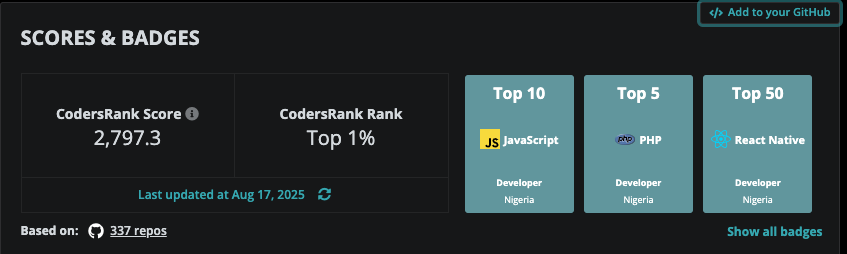

### Hey there 👋

As an Fullstack Engineer, I have dedicated my career to helping Innovative Startups provide value for users with thoughtfully engineered products. With a strong background in Software Engineering, I specialize in React Native mobile development both targeting Android and iOS operating systems. 

Throughout my professional journey as an Engineer, I have had the opportunity to play a key part in the development of successful mobile projects such as the DogeCoin-2.0, Kwara, Kilimanjaro, and Betprotect mobile Apps, among others. I have worked and collaborated with Software teams across Europe, North America, and Australia, employing both Agile/Scrum and Waterfall methodologies. My commitment to building scalable and performant software has allowed me to develop a unique perspective and a versatile skill set that I continuously strive to apply and expand.

- 📍Currently based in Lagos, Nigeria 
- 👯 Looking to collaborate on exciting projects
- 💪 Daily improving my DS and Algo skills 
- 😄 Pronouns: On a regular day, I go by He/Him, on days I need to deliver for my team, I go by Lord/Saviour ...
- 💬 Open to talk about Technical Writing, Javascript, Laravel, PUBG or Mental Health.
- 🎵 Enjoys Listening to Juice Wrld / Nasty C_

I am always eager to connect with like-minded professionals and explore new opportunities for growth, collaboration, and learning. If you're interested in discussing Mobile Engineering, Mental Health or Technical Writing, or potential collaboration, feel free to reach out to me via [LinkedIn](https://linkedin.com/in/theafolayan) or email at oluwaseun[@]mytherapist.ng.

<!--
**theafolayan/theafolayan** is a ✨ _special_ ✨ repository because its `README.md` (this file) appears on your GitHub profile.

Here are some ideas to get you started:

- 🔭 I’m currently working on ...
- 🌱 I’m currently learning ...
- 📫 How to reach me: ...
- 😄 Pronouns: He/Him...
- ⚡ Fun fact: ...
-->
